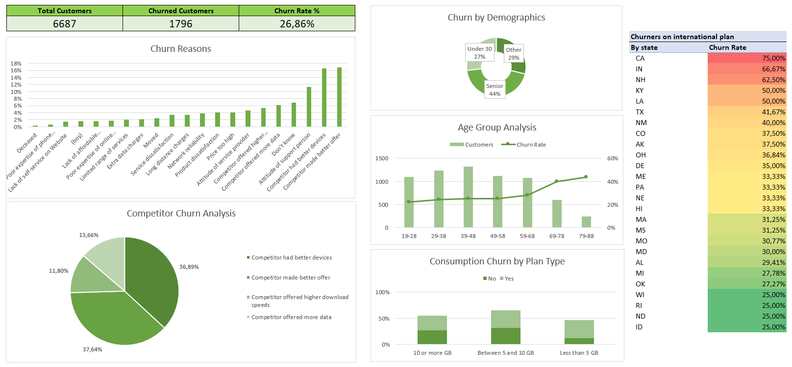

## Portfolio

---

### Data Analytics Projects

[Hotel Revenue Analysis](projects/hotel_revenue_analysis.md)

  Skills used:
  SQL
  MySQL
  Power BI

---

[Telecommunications Customer Churn Analysis](projects/telecom_churn_analysis.md)

  Skills used:
  Excel

