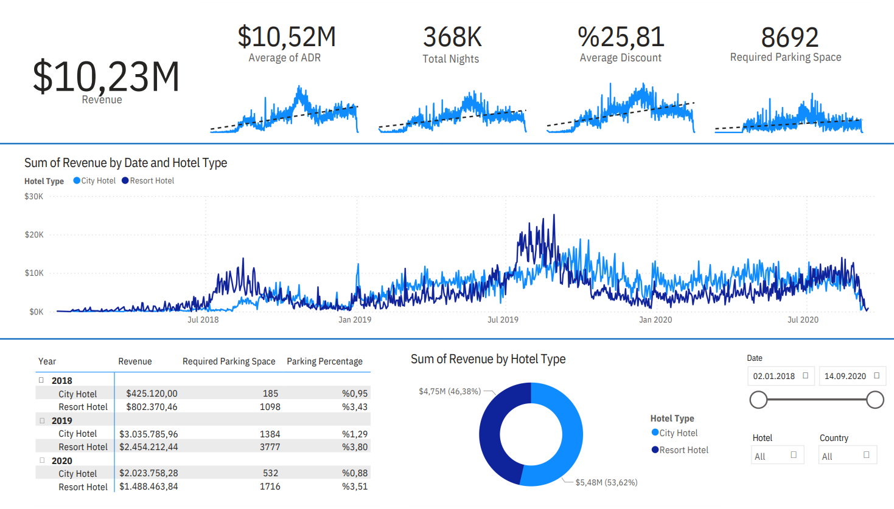
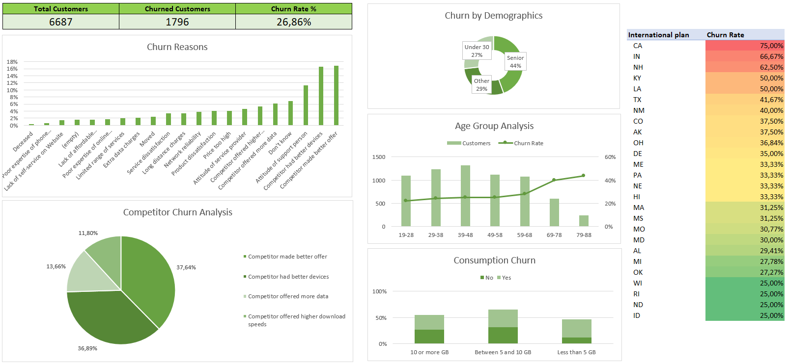

## Portfolio

---

### Data Analytics Projects

[Hotel Revenue Analysis](projects/hotel_revenue_analysis.md)

  Skills used:
  SQL
  MySQL
  Power BI

---

[Telecom Provider Customer Churn Analysis](projects/telecom_churn_analysis.md)

  Skills used:
  Excel

### Academic Projects

Cross-Linguistic Analysis of Phonemes and Phoneme Inventories
- _Undergraduate Thesis in Linguistics_

Multiple Linear Regression Analysis on Pharmaceutical Drug Sales
- _Term Project in Information Systems_

Morphological Parser for Turkish Using Finite State NLP Tools
- _Term Project in Computational Linguistics (Collaborative)_
