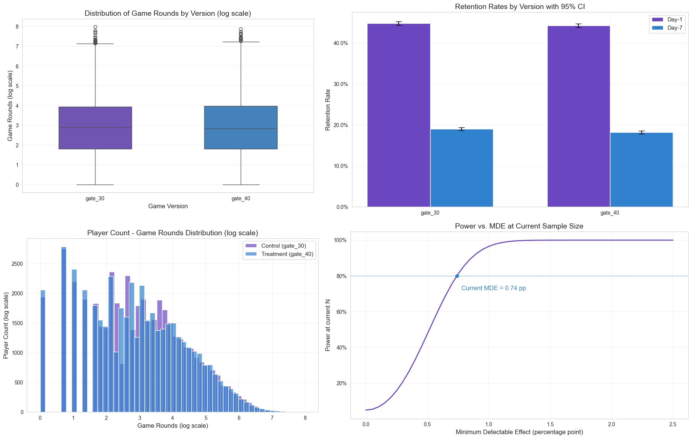
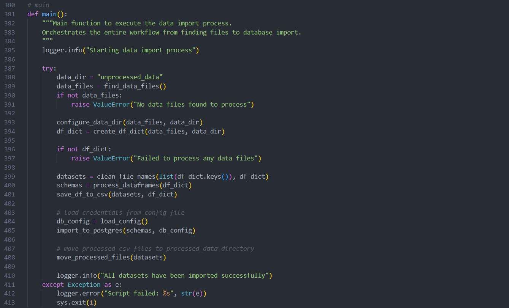

## Portfolio 

---

### Data Science & Analytics Projects

 
[Cookie Cats Retention A/B Test](https://github.com/dorukalkan/cookie-cats-ab-test) 

  python
  pandas
  statsmodels
  scipy
  matplotlib
  seaborn

---

 
[Hotel Revenue Analysis](projects/hotel_revenue_analysis.md) 

  sql
  mysql
  power bi

---

 
[Telecom Provider Customer Churn Analysis](projects/telecom_churn_analysis.md) 

  excel

---

### Data Engineering Projects

 
[Multi-Format PostgreSQL ETL Automation](https://github.com/dorukalkan/pgdatahub) 

  python
  postgresql
  pandas
  psycopg2
  excel
  json

---

### Academic Projects

 
Cross-Linguistic Analysis of Phonological Markedness and Phoneme Inventories 
_Undergraduate Thesis in Linguistics_ 

  python
  pandas
  scipy
  matplotlib
  seaborn
  google sheets

---

 
Multiple Linear Regression Analysis on Pharmaceutical Drug Sales 
_Term Project in Information Systems_ 

  r
  excel

---

 
[Morphological Parser for Turkish Using Finite State NLP](https://github.com/eklerproject/ekler) 
_Term Project in Computational Linguistics (Collaborative)_   

  python
  hfst
  streamlit

