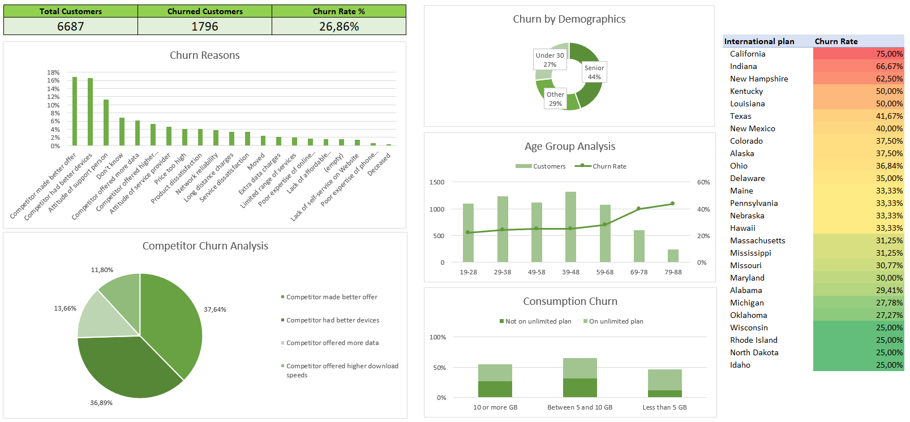
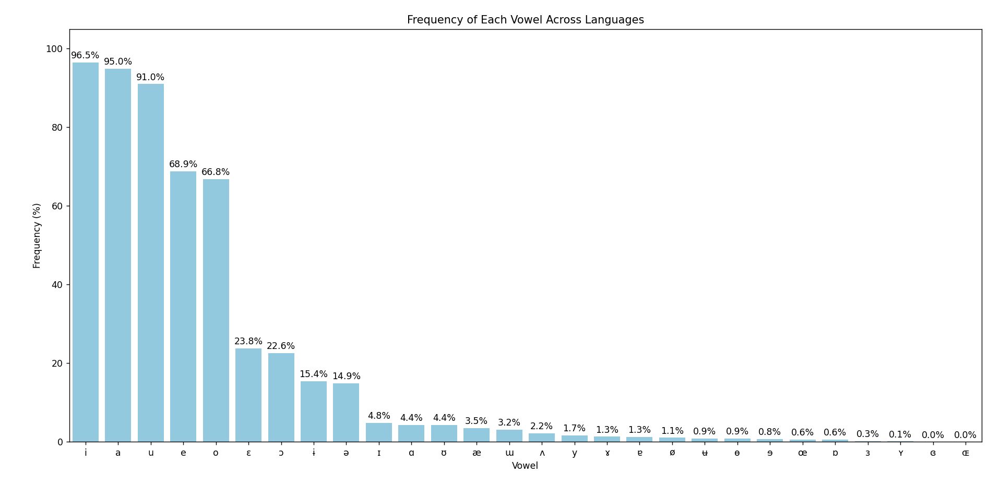
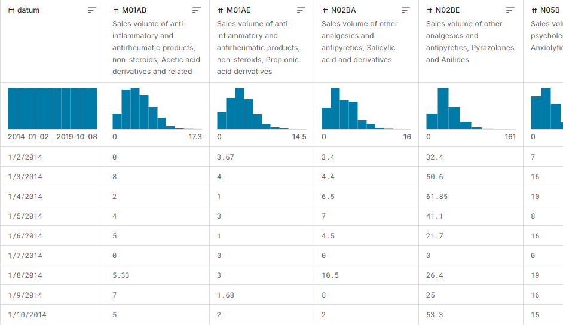
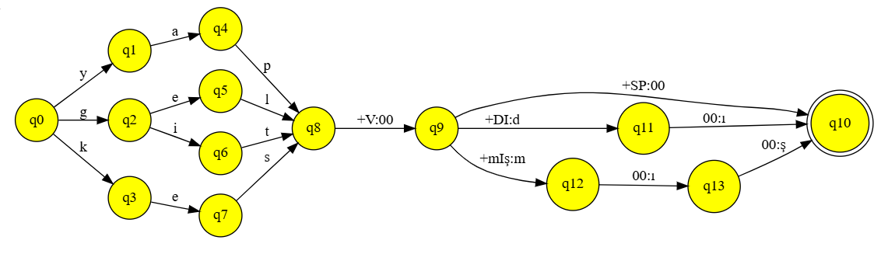

## Portfolio

---

### Data Analytics Projects

 
[Hotel Revenue Analysis](projects/hotel_rev_dashboard.md) 

  sql
  mysql
  power bi

---

[Telecom Provider Customer Churn Analysis](projects/telecom_churn_analysis.md)

  excel

---

### Academic Projects

Cross-Linguistic Analysis of Phonological Markedness and Phoneme Inventories 
_Undergraduate Thesis in Linguistics_

  python
  pandas
  scipy
  matplotlib
  seaborn
  google sheets

---

Multiple Linear Regression Analysis on Pharmaceutical Drug Sales 
_Term Project in Information Systems_

  r
  excel

---

[Morphological Parser for Turkish Using Finite State NLP](https://github.com/eklerproject/ekler) 
_Term Project in Computational Linguistics (Collaborative)_  

  python
  hfst
  streamlit

